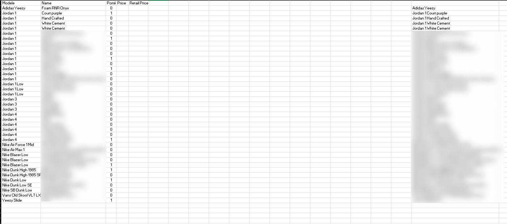
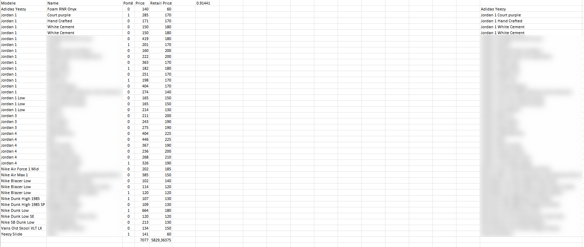

# BotPyListingPrice

Ce projet vise à scraper les prix sur StockX en utilisant Beautiful Soup 4 et à créer un tableau récapitulatif du prix de toutes les chaussures.
Pourquoi j'ai fait ce bot?
J'ai fait ce bot car j'ai une passion pour les vêtements ainsi que les chaussures. J'ai une certaine collection et c'est assez embêtant de devoir calculer la valeur totale de la collection. Donc, j'ai créé ce bot pour pouvoir savoir combien d'argent je possède en chaussures :)

## Installation

1. Clonez ce dépôt sur votre machine locale.
2. Assurez-vous d'avoir Python installé sur votre système.
3. Installez les dépendances en exécutant la commande suivante :

```shell
pip install beautifulsoup4
```

## Utilisation

Je pense que le script ne fonctionne plus maintenant mais j'ai quelques photos de quand il fonctionnait
1. Photo de mon tableau ou je venais recuperer le nom de mes paires 
   
2. Photo de mon tableau avec l'argent
   
